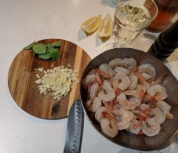

# Krewetki z patelni z czosnkiem, tabasco, miodem w maślano-winnym sosie.

 

**Cel**: Odrobinka śródziemnomorskich klimatów i szybkość przygotowania + epicki smak (2 – 3 osoby);

Sprawdź pozostałe przepisy - [PRZEPISY](https://blog.krzysztofbury.pl/przepisy/).

 

**Składniki:**

- 500 g (2 / 3 opakowania lub około 40 szt.) krewetek (ja użyłem Krewetki Vannamei Białe z Biedronki 3 opakowania) – surowe lub gotowe, mrożone lub świeże to obojętne;
- 5 ząbków czosnku, drobno posiekany
- 60 g masła
- 0,5 szklanki białego wina (w zależności ile wina tyle będzie sosu)
- Tabasco (może być papryczka chilli)
- 2 łyżki miodu (jaki jest w domu J)
- sól, listki bazylii cytrynowej (może być zwykła) – posiekane
- połówka cytryny

 **Przygotowanie:**

1. W zależności od krewetek, które kupiliśmy:
    - Mrożone krewetki włożyć do miski, wlać letnią wodę i rozmrozić;
    - Nieobrane krewetki obrać z pancerzy (pozostawić ogonki);
    - Nieoczyszczone krewetki naciąć lekko nożem wzdłuż tułowia i usunąć czarne jelito;
2. Po oporządzeniu krewetek należy je jeszcze raz opłukać i dokładnie osuszyć;
3. Na patelni wrzucić masło, dodać drobno posiekany czosnek skropić delikatnie tabasco (3 / 4 wstrząśnięcia) smażyć przez około pół minuty;
4. Dodać krewetki, posiekane listki bazylii i miód;
5. Dokładnie wymieszać i smażyć przez minutę;
6. Wlać wino i na większym ogniu odparować, w międzyczasie mieszając – około 2 minuty;
7. Na koniec doprawić solą i skropić cytryną;
8. Podawać z kawałkiem bagietki / bułki;
