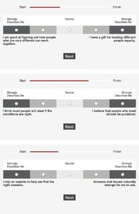

\[heading align="left"\] Kim ja właściwie jestem? \[/heading\]

W tym wpisie poruszę temat cech osobowości i testów które pomogą Ci je poznać. Omówię dwa testy **16 osobowości** oparty o teorie osobowości **Carl-a Jung-a**, stworzony i zaprojektowy przez **Isabelle Briggs Myers** i **Strengths Finder Donald-a O. Clifton-a i Tom-a Rath-a**.

Krzyśku ale do czego mi to w ogóle potrzebne - możesz zapytać cytując klasyka: „a na ch\*j mnie ten kaktus” ([https://www.youtube.com/watch?v=zylh5BMVZpY](https://www.youtube.com/watch?v=zylh5BMVZpY)) – bardzo dobre pytanie. Jest conajmniej kilkanaście powodów dla których warto rozważyć wykonanie takiego testu.

Poznanie swojego typu osobowści / swoich mocnych stron pozwala na:

- zidentyfikowanie unikatowych cech i niejednokrotnie „słabych” stron
- łatwiej zrozumiesz swoje zachowanie i zaakceptujesz to dlaczego w określonych sytuacjach zachowujesz się tak a nie inaczej
- rozwiniesz swoją inteligencję emocjonalną
- komunikacja i praca z innymi „może” być łatwiejsza (szczególnie jak cały zespół podejmie się realizacji takiego testu)
- znajac swoje cechy i mocne strony każdą z nich możesz przekuć w swój atut

W telegraficznym skrócie o samych testach:

\[heading align="left"\] **16 typów osobowości**  \[/heading\]

Często zwane testem **MBTI** – Myers-Briggs Type Indicator® \[1\] klasyfikuje Cię jako 1 z 16 typów (kombinacji cech) osobowości w zależności od odpowiedzi udzielonych, w 4 dziedzinach / kategoriach testu.

Krótki opis każdego z 16 typów znajdziecie poniżej (na podstawie strony: [https://www.16personalities.com/pl/typy-osobowosci](https://www.16personalities.com/pl/typy-osobowosci) **\[2\]**)

- **Analitycy**
    - INTJ - obdarzeni wyobraźnią i strategiczni myśliciele z planem na wszystko;
    - INTP - pomysłowi wynalazcy z niezaspokojonym pragnieniem zdobywania wiedzy;
    - ENTJ - odważni, obdarzeni wyobraźnią liderzy o silnej woli, zawsze wynajdujący rozwiązanie lub tworzący je;
    - ENTP - inteligentni i ciekawi myśliciele, którzy nie potrafią oprzeć się intelektualnemu wyzwaniu;
- **Dyplomaci**
    - INFJ - spokojni i tajemniczy, a jednocześnie bardzo inspirujący i niestrudzeni idealiści;
    - INFP - uprzejmi i altruistyczni ludzie o poetyckiej duszy, zawsze chętni do pomocy dla dobrego celu;
    - ENFJ - charyzmatyczni i inspirujący liderzy, potrafiący mocno uchwycić uwagę swoich słuchaczy;
    - ENFP - entuzjastyczni, twórczy i towarzyscy ludzie charakteryzujący się tzw. wolnym duchem, którzy zawsze znajdą powód, aby się uśmiechnąć;
- **Strażnicy**
    - ISTJ - praktyczni i skupieni na faktach indywidualiści, których niezawodności nie da się podważyć;
    - ISFJ - bardzo oddani i czuli opiekunowie, zawsze gotowi bronić swoich ukochanych;
    - **ESTJ -** doskonali administratorzy, którzy lepiej niż ktokolwiek inny potrafią zarządzać różnymi sprawami lub ludźmi;
    - ESFJ - niesłychanie troskliwi, towarzyscy i popularni ludzie, zawsze skorzy do pomocy;
- **Odkrywcy**
    - ISTP - odważni i praktyczni eksperymentatorzy, mistrzowie wszelkich narzędzi;
    - ISFP - elastyczni i uroczy artyści, zawsze gotowi, aby poznawać i doświadczać czegoś nowego;
    - ESTP - inteligentni, energiczni i spostrzegawczy ludzie, którzy na prawdę uwielbiają życie na krawędzi;
    - ESFP - spontaniczni, energiczni i entuzjastyczni animatorzy - życie nigdy nie jest nudne przy nich;

Wytłumaczmy sobie jeszcze co oznaczają poszczególne litery (która z cech jest dominująca): **E** – ekstrawertyzm; **I** – introwertyzm; **N** – intuicja; **S** – uczucia (odczuwanie); **T** – myślenie (racjonalne); **F** – kierowanie się intuicją (uczuciami); **J** – osądzanie / sądzenie (na podstawie faktów); **P** – postrzeganie;

\[highlight\] Mój wynik: **ESTJ** \[/highlight\]

 

\[heading align="left"\] **Strengths Finder** \[/heading\]

Jest płatnym (na stronie lub razem z książką otrzymamy kod **\[3\]**) testem, który w wersji podstawowej odkrywa Twoich **5 najsilniejszych stron**. Często mamy uczucie że dana rzecz / sposób wykonywania czynności jest dla nas oczywisty, ten test weryfikuje / pokazuje Ci dlaczego tak jest i jaka mocna strona to determinuje, daje również wskazówki jak wykorzystać swoje mocne strony na codzień.

Test składa się z około **180 pytań**, można go wypełnić w wersji polskiej lub angielskiej – czas na to poświęcony to około **40 minut**. Składnia testu jest nieco zbliżona do MBTI jednak w każdym pytaniu są 2 opcje (**uwaga:** 20 sekund na odpowiedź) i każda z opcji rozciąga się na 3 możliwości od „Zdecydowanie mnie dotyczy” po opcję „Neutralne”. Po rozwiązaniu testu dostajemy informację jakie jest 5 naszych silnych stron i pomysły na akcje które możemy wykonać uwzględniające nasze silne strony.

Przykład pobrany ze strony: [http://www.melyssagriffin.com/strengthsfinder/](http://www.melyssagriffin.com/strengthsfinder/) 

Autorzy testu rozróżniają 34 potencjalne silne strony  (nazwy oryginalne – krótki opis każdej z nich w  przypisie **\[4\]**): Achiever®; Activator®; Adaptability®; Analytical®; Arranger®; Belief®; Command®; Communication®; Competition®; Connectedness®; Consistency®; Context®; Deliberative®; Developer®; Discipline®; Empathy®; Focus®; Futuristic®; Harmony®; Ideation®; Includer®; Individualization®; Input®; Intellection®; Learner®; Maximizer®; Positivity®; Relator®; Responsibility®; Restorative®; Self-Assurance®; Significance®; Strategic®; Woo®;

\[highlight\] Mój wynik (kolejność cech jest ważna – najsilniejsza na początku): \[/highlight\]

- **Input** – żądza / chęć posiadania większej wiedzy / wiedzy z różnych dziedzin – często związane ze zbieraniem I przechowywaniem różnych informacji;
- **Achiever** – duże pokłady wyrzymałości i ciężkiej pracy – dużo radości sprawia takim osobom bycie produktywnym i zajętym;
- **Analytical** – przyczyny i powody cechują osoby u których ta cehca jest silna – nierzadko takie osoby myślą o każdym jednym szczególe które może mieć wpływ na daną sytuację;
- **Learner** – pasja i chęć do nauki i ciągłego doskonalenia się – fascynujący dla osób z tą cechą jest często sam process nauki, nie do końca jej wyniki;
- **Discipline** – rutyna, procesy i jasne struktury to rzeczy które osoby z tą silną cechą lubią najbardziej;

 

Podsumowując, polecam wykonanie dowolnego testu. Poznanie swoich silnych strony / cech osobowści, da Ci wiedzę, dlaczego zachowujesz się w taki a nie inny sposób, jak wykorzystać swoją osobowścią do dawania jak największej wartości ale również a może przede wszystkim powinnien Ci uświadomić że każdy z nas jest inny ma inną osobowość inne silne strony i ta różnica nie jest niczym złym. Mając tą wiedzę nauczmy się ją wykorzystywać na codzień a rezultaty mogą nas samych zaskoczyć.

 

Dzięki,

Krzysiek

 

\[1\] [http://www.myersbriggs.org/my-mbti-personality-type/mbti-basics/home.htm?bhcp=1](http://www.myersbriggs.org/my-mbti-personality-type/mbti-basics/home.htm?bhcp=1)

\[2\] [https://www.16personalities.com/pl](https://www.16personalities.com/pl)

\[3\] [http://strengths.gallup.com/110440/About-StrengthsFinder-20.aspx](http://strengths.gallup.com/110440/About-StrengthsFinder-20.aspx)

\[4\] [http://www.strengthstest.com/strengths-finder-themes](http://www.strengthstest.com/strengths-finder-themes)
