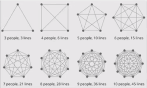
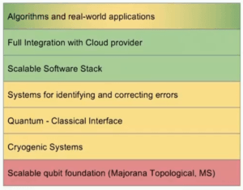
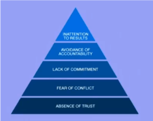
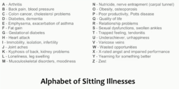
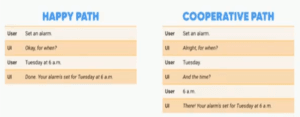
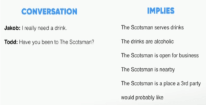

**DevConf 2018** konferencja dla programistów i nie tylko w której miałem przyjemność uczestniczyć. Trzydniowe wydarzenie (26 - 28 września) w Krakowie, zrealizowane w genialnym jak na konferencje miejscu - sali kinowej w Multikinie. **34** prelegentów, **1** dzień warsztatów (**4** różne warsztaty do wyboru), **2** dni prelekcji (**35** różnych prelekcji w 3 równoległych ścieżkach).

Słuchałem 10 prelekcji tytuły prelekcji i prelegenci poniżej:

- It’s a Small World After All - **Sander Hoogendoorn**
- Is Quantum Computing Really a Thing? - **James Birnie**
- Essentials for Building and Leading Highly Effective Development Teams - **Tugberk Ugurlu**
- Cloud is Like Alcohol - **Piotr Stapp**
- LIGHTNING TALKS
    - Painting Mona Lisa with Artificial Intelligence - **Agnieszka Jach**
    - Delivery Passion - **Jakub Gutkowski**
    - Cryptocurrency - The Dark Side - **Piotr Stapp**
- Sitting Considered Deadly - **Marek Stój**
- Thinking Fast and Slow - **Linda Rising**
- Modern SQL: Evolution of a Dinosaur - **Markus Winand**
- Google vs Alexa: Battle of the Bots **\- Heather Downing**
- Micro Frontends and UI Composition - a Code-First Dive - **William Brander**

Wszystkie materiały z konferencji były nagrywane i są dostępne na YouTube link [Tutaj](https://www.youtube.com/watch?v=KCXERFtx3KY&list=PL8BUDiR2Y8YvhzYYxoetZ3PWzXK3CJwtu)

Notatki z wykładów poniżej w j. angielskim, zachęcam do obejrzenia interesujących Cię tematów na YT.

## **It’s a Small World After All**

- Working products - products not projects
- Shorter cycles - continuous flow
- Smaller teams - self-organizing autonomous
- Smaller components - microservices serverless
- Roadmaps over plans
- Smaller, shorter, faster - think about that in terms of “Enterprise Agile Transformation”
- Find your own way! - don’t just copy someone else’s model
- “To satisfy the customer through early and continuous delivery of valuable software”
- Clear communication is Key

- Leadership is contextual - leaders are not necessarily managers, Managers are not necessarily leaders
- STOP doing Projects

## **Is Quantum Computing Really a Thing?**

- Qubit - 2 possible outcomes for the measurement of a qubit - usually 0 and 1
    - state of qubit is unknown until it is observed
    - before the observation the state is a “probability space”
- No meaningful storage for qubits state
- Roadmap
    - Optimistic View - 2028
    - Realistic View - 2048
    - Pessimistic View - Never!

## **Essentials for Building and Leading Highly Effective Development Teams**

- Solve the right problems for the business and users - Goal of Dev Teams
- Effectiveness != Efficiency
- Being **effective** is about doing the right things
    - **Effectiveness \- the degree to which something is successful in producing a desired result**
- Being **efficient** is about doing things right
    - **Efficiency \- act of performing or functioning in the best possible manner with the least waste of time and effort**
- Books to read:
    - [The Mom Test](http://momtestbook.com/)
    - Jobs-To-Be-Done – people buy products and services to get a “job” done
- Hypothesis Driven Development vs User Stories
- The Five Dysfunctions of a Team

- Opinions vs Principals
- Lead by example

## **Cloud is Like Alcohol**

All below are quotes from one of the slides - accurate!

- You can overdose it quite easy
- It shows how weak is your Team
- but it add much more speed
- Be careful and think 2 moves forward
- The start is easy, maybe even to easy …
- No admin but DevOps
- Security is hard

## **Sitting Considered Deadly**

- Sitting is a new smoking
- Book to read: Get Up! - James A. Levin
- 1 cigarette = 11 minute lost of life ~ 7 years lost
- 1 hour of sitting = 2 hours lost of life ~ 15 years lost
- N.E.A.T - Non-Exercise Activity Thermogenesis
- Stand Up!
- Alphabet of Sitting Illnesses

## **Thinking Fast and Slow**

- Book: Thinking Fast and Slow - Daniel Kahneman
- Two Systems Exists in us
    - System 1:
        - Unconscious (runs 24/7)
        - Fast
        - Intuitive
        - Can multitask
        - Remembers everything
        - ~ 11 million bits / sec
        - 95% of cognitive function
        - BUT inaccessible
        - Our gut feeling, source of insight
    - System 2:
        - Conscious (on-line when awake)
        - Slow
        - Rational
        - Linear
        - Forgetful
        - ~ 40 bits / sec
        - 5% of cognitive function
        - Chatters constantly while we are awake
        - We identify with it, believe it’s in charge

## **Modern SQL: Evolution of a Dinosaur**

- Why you are still using SQL-92 standard when it is the same age as Windows 3.1

Below is the list of functionalities that were introduced (among many others), particularly interesting is the list of availability of this functionality in popular databases.

- 1999 – WITH (Common Table Expressions)
- 1999 – WITH RECURSIVE (Common Table Expressions)
- 2003 – OVER and PARTITION BY | OVER and ORDER BY
- 2006 – XML and xPaths
- 2008 – FETCH FIRST
- 2011 – OFFSET – STOP USING IT

**OFFSET** - slow and wrong (pagination like queries, but doesn’t take into account inserts that took place).

[How to avoid OFFSET](https://use-the-index-luke.com/no-offset)

Additional presentation about Row Pattern Matching (https://www.slideshare.net/MarkusWinand/row-pattern-matching-in-sql2016)

- SQL: 2011 – OVER (upgrade) – LEAD, LAG, …,  NTH\_VALUE
- SQL: 2011 – SYSTEM VERSIONING (slowly changing dims :))
- SQL: 2016 – MATCH\_RECOGNIZE (Row Pattern Matching – used in processing time series)
- MATCH\_RECOGNIZE applies regular expressions on rows.

## **Google vs Alexa: Battle of the Bots**

- By 2021 more than 50% of enterprises will spend more per annum on bots and chatbot creation than traditional mobile app development (Gartner, 2017)
- When it comes to Voice follow “Grice’s Maxims”: Quality (Being True), Quantity (Being Brief), Relevance (Being Relevant), Manner (Being Clear)

 

- 01 Intents -> various commands the user can access
- 02 Sample Utterances -> specific words / phrases the user can say to invoke your intents
- 03 Invocation Name -> the word / phrase that the user speaks to identify your skill
- 04 Endpoint / Fulfillment -> accepts these intents and acts upon them
- 05 Portal Configuration -> ties everything together and routes requests to the web service for your skill

 

Jeśli miałbym wybrać tylko 3 prelekcje do polecenia, byłyby to zdecydowanie:

- It’s a Small World After All - **Sander Hoogendoorn** \- mocne otwarcie konferencji, dobry przekaz i masa doświadczenia;
- Sitting Considered Deadly - **Marek Stój** \- profesjonalizm, świetne przygotowanie, dobry kontakt z salą i spora dawka wiedzy;
- Thinking Fast and Slow - **Linda Rising** \- inspirujący temat, pasja i zaangażowanie, świetne otwarcie ostatniego dnia konferencji; 
- **Bonus:** Modern SQL: Evolution of a Dinosaur - **Markus Winand** \- to bardziej branżowo dla mnie, świetna energia na scenie, pasja i solidna dawka wiedzy :)

 

Dzięki,

Krzysiek
