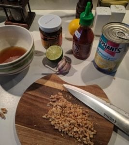

**Cel**: Realizacja [zadania 17 - Master Chef](https://blog.krzysztofbury.pl/zadania/), poziom 1: potrafię ugotować po 1 daniu z każdej głównej kuchni świata;

Dodatkowo szybkie i proste danie o świetnym smaku.

 

\[row\] \[two\_third\]

**Składniki**:

- 250 g makaronu ryżowego - szerszy - 3mm
- 4 ząbki czosnku (może być mniej 2 / 3)
- pierś z kurczaka / krewetki
- 3 jajka
- 3/4 puszki kiełków fasoli mung
- pół papryki czerwonej (opcjonalnie)

**Sos**

- sos rybny (4 łyżki)
- sok z limonki (połówka limonki)
- pasta tamaryndowa (2 łyżki)
- cukier (3 łyżki lub 2 łyżki miodu)
- sos sriracha (1 łyżka lub inny ostry sos na bazie chilli)

**Przed podaniem**

- szczypiorek
- kiełki fasoli mung (pozostała część puszki)
- prażone orzeszki ziemne (do posypania wedle uznania - posiekane)

\[/two\_third\] \[one\_third\]

 

 \[/one\_third\] \[/row\]

 

**Przygotowanie:**

- Makaron ryżowy dodaj do garnka z gotującą się wodą i gotuj przez ok. 5 min; po tym czasie odcedź makaron na sitku;
- Składniki sosu dokładnie wymieszaj w miseczce;
- Rozgrzej olej (słonecznikowy / jaki masz pod ręką - 2 łyżki) na woku (lub większej patelni); dodaj czosnek (możesz pokroić go na cienkie plastry lub zmiażdżyć) i papryką (albo w plastrach albo skrojoną w drobną kostkę);
- Dodaj skrojoną na drobną kostkę pierś z kurczaka I smać przez około 5 - 7 minut;
- Wbij jajka i podsmaż całość przez ok. minutę w między czasie delikatnie mieszając;
- Dodaj makaron wymieszaj i całość smaż przez ok. 5 minut (po 2 / 3 minutach wlej sos)
- Przed zakończeniem gotowania dodaj kiełki fasoli mung i wymieszaj całość;
- Przed podaniem (już na talerzu) posyp całość posiekanymi orzeszkami, szczypiorkiem i resztą kiełków fasoli;

 

Smacznego!
