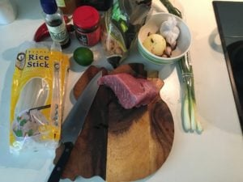
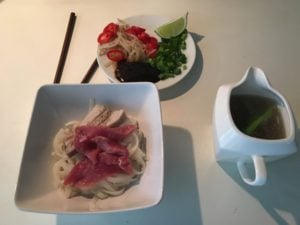

Tym razem odwiedzamy Azję a dokładnie **Wietnam** i kosztujemy, niesamowitej zupy - **Pho Bo**.

**Cel:** Realizacja [zadania 17 - Master Chef](https://blog.krzysztofbury.pl/zadania/), poziom 1: potrafię ugotować po 1 daniu z każdej głównej kuchni świata;

Na podstawie przepisów ze stron:

- [KwestiaSmaku.com](https://www.kwestiasmaku.com/kuchnia_orientu/pho/przepis.html) 
- [KuchniaAzjatycka.com](http://kuchniaazjatycka.com/pho-bo-zupa-wolowa-z-makaronem-ryzowym-i-ziolami/)

Starałem się żeby jak najlepiej odwzorować przepis opisany na stronie KuchniaAzjatycka.com,  niestety nie udało mi się kupić wszystkich składników, dlatego w mojej wersji mały miks i parę drobnych zmian, zakładam że smakowo mogę odbiegać od oryginału. Nie mniej jednak jak na osobę, która nie jest wielkim fanem zup, Pho Bo jest obłędna!

\[heading align="left"\] Składniki (na 2 osoby - 6/8 zup): \[/heading\]

\[row\] \[one\_half\]

**Bulion**

- 3 goździki
- 2 anyże gwiazdkowe
- cynamon (1 łyżeczka)
- kardamon (1 łyżeczka)
- pieprz biały mielony (0,5 łyżeczki)
- 1 łyżeczka miodu
- korzeń Imbiru (4 / 5 cm)
- 1 łyżeczka soli
- 4 ząbki czosnku
- 1 duża cebula
- 60 ml sosu rybnego
- 500 g wołowiny z kościa (ogon wołowy / szponder / ewentualnie żeberka wieprzowe - tez dadzą radę ale smaku nie gwarantuje)
- 500 g kości szpikowych
- 5 cebulek dymek

**Do Podania**

- 200 g wołowiny (pieczeń / rumsztyk) lub polędwicy
- papryczka chili x2
- kiełki fasoli mung
- tajska bazylia
- limonka
- sos Hoisin
- pęczek szczypiorku
- makaron ryżowy (0,5 kg)

\[/one\_half\]

\[one\_half\]

\[/one\_half\] \[/row\]

\[heading align="left"\] Przygotowanie \[/heading\]

**Bulion:**

1. Wołowinę z kością i kości szpikowe wrzucić do dużego garnka, zalać zimną wodą, posolić i odstawić na około godzinę
2. Goździki i anyż (w moim przypadku) podprażyć 2 - 3 minuty na patelni
3. Po podprażeniu rozgnieć goździki i anyż i odłóż na gazę / bandaż, dodać pieprz biały, cynamon i kardamon - zawiąż gazę / bandaż
4. Cebulę, czosnek i imbir opal na kuchence, tylko delikatnie przypalając zewnętrzną warstwę, następnie wystudź, obierz ze skórki i posiekaj
5. Po godzinie mięso i kości wyjąc z osolonej wody, garnek wypłucz, włóz z powrotem mięso i kości i zalej zimną wodą tak żeby przykryła produkty (mięso i kości)
6. Gotuj na dużym ogniu przez około 15 min - zdejmij "szum"
7. Po tym czasie zmniejsz gaz do najmniejszego, dodaj sos rybny, łyżeczkę soli, miód, posiekany wcześniej czosnek, imbir i cebulę, oraz gazę / bandaż z przyprawami
8. Garnek przykuj pokrywką i gotuj przez 4.5 - 5 godzin
9. Wyjmij mięso, bulion przecedź przez sito do czystego garnka
10. Kości nie będą już potrzebne, od mięsa z kościa odseparuj kość a samo mięso pokrój na plastry (dodaj je później do zupy - ja po skrojeniu na plastry dodałem platry do bulionu)
11. Dodaj cebulę dymkę (końcówki - szczypior będzie Ci potrzebny do podania :)) i całość zostaw na małym gazie
12. Jeżeli chcesz ugotować surowe mięsto przy podaniu bulion musi być gorący

**Podanie:**

1. Makaron ryżowy ugotować według przepisu na opakowaniu, po ugotwaniu rozłożyć do naczynia (objętość taka jaką zjesc :))
2. Mięso (rumsztyk / polędwicę) pokroić na cieniutkie paseczki (w poprzek włokien) i ułożyć na makaronie
3. Dołożyć skrojone na plastry mięso z bulionu (ilośc wedle uznania)
4. Całość zalać bulionem
5. Dodatkowo, jeżeli chcesz: dodać plasterki chili, szczypior, kiełki fasoli mung, tajską bazylię, skropić skiem z limonki a do mięsa dorzucić sos hoisin

Smacznego!
