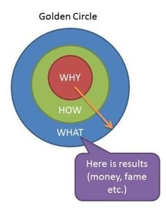

10 wartościowych myśli z książek przeczytanych w 2019 roku, taka mała tradycja. To już kolejny rok w którym przygotowałem dla Ciebie moje prywatne książkowe podsumowanie. Zapraszam do czytania kilka książek 10 wniosków.

 

## **Jak zostać milionerem? Szybko.** 

Cytując autora: zamiast kupować produkty z reklam, sprzedawaj je. Zamiast szukać złota, sprzedawaj łopaty. Zamiast Zamiast szukać zatrudnienia, Ty zatrudniaj. 

Za tymi przeciwieństwami stoi jedna rzecz - zmiana myślenia. Tradycyjnie, rodzimy się, uczymy się, znajdujemy pracę i klepiemy do emerytury. To powolna droga, rzadko kiedy prowadząca do dużych dochodów / oszczędności. 

Zmieniając myślenie z powolnego budowania kapitału na szukanie sposobów jak go szybko powiększyć, trzeba będzie się liczyć z kilkoma fundamentalnymi elementami. Zmiana stylu życia, podejścia do biznesu, “właściwego” wykorzystania dźwigni finansowej. 

**Książka**: [Millionaire Fastlane](https://www.amazon.com/Millionaire-Fastlane-Crack-Wealth-Lifetime/dp/B0146TGBZ8/ref=sr_1_1?keywords=fastlane+millionaire&qid=1577710393&s=books&sr=1-1)

 

## **Nie możesz być dobry we wszystkim**

Powyższe zdanie i poniższe punkt są stwierdzeniami w kontekście własnego biznesu i podejścia do niego. 

- Doskonałość wymaga poświęceń. 
- “Musisz” obniżyć jakość elementów które nie są wartościowe dla Twoich Klientów. 
- Nie wierz w to, że wszyscy pracownicy będą pracować z takim samym zapałem jak Ty czy pojedyncze wyjątkowe jednostki.
- Zbadaj / Sprawdź co Twoi Klienci cenią sobie najbardziej
- Maksymalnie upraszczaj swoje produkty, by były one również proste do zrozumienia dla Twoich pracowników

**Książka:** [Uncommon Service](https://www.amazon.com/Uncommon-Service-Putting-Customers-Business/dp/1422133311/ref=sr_1_1?crid=1VLNZFYMBC7R&keywords=uncommon+service&qid=1577710416&s=books&sprefix=uncommon+service%2Caudible%2C237&sr=1-1)

 

## **Om Om, poczuj jak mózg spływa Ci w tył czaszki - Medytacja Na Wesoło**

Medytacja ciekawa sprawa. Gdy zaczynałem kierowałem się raczej ciekawością - bo przecież wszyscy “którym wyszło” medytują … bleh, głupota. Ciągłe porównywanie się do innych. 

To nie była dobra droga i jak się okazało moja przygoda z medytacją po takiej “motywacji” nie trwała długo. Kolejny raz spróbowałem korzystając z aplikacji Headspace czytając równolegle książkę od twórców tej aplikacji właśnie. To byla tak zwana “medytacja kierowana (guided)” ktoś z głośniczka, “prowadzi Cię za rączkę” i mówi teraz skup się na tym, teraz oddychaj tak teraz siak. 

To już było lepsze, ale najlepsze miało dopiero przyjść. Siedziałem kiedyś i zdałem sobie sprawę, że w tym całym zabieganiu dnia, nie mam nawet 15 minut dla siebie, dla moich myśli. Nie miałem czasu, żeby się spokojnie zastanowić co ja tak właściwie robię. 

Stwierdziłem wtedy, że takie 15 minut w moim życiu musi się pojawić. Czas który będzie tylko dla mnie i mojej głowy. Czas w którym jedynym celem, będzie skupienie się na oddechu, nie na celach, planach,  zadaniach. Zaczynałem od 5 minut każdego dnia. Tego nawet nie poczujesz uwierz mi, przez pierwsze 30 dni, nie widziałem wielkich zalet. Jednak w miarę upływu czasu i zwiększa długości sesji z 5 na 10 i ostatnio z 10 na 15 min. Zacząłem zauważać, większą świadomość w tym co robię. Świadomość a może raczej, skupienie na konkretnej czynności. 

Dalej mam moment rozproszenia, ale częściej je zauważam i wracam do tego czym się aktualnie zajmuję. Nie wiem w 100% czy to wynik samej medytacji / pracy nad świadomością tego co robię czy może coś jeszcze. 

Wiem, że na pewno warto spróbować i zobaczyć czy to jest dla Ciebie. Jeżeli towarzyszą Ci setki myśli, łatwo się rozpraszasz i zmieniasz kontekst, spróbuj, zacznij od 5 min każdego dnia i zwiększaj długość w miarę upływu czasu. Efekty mogą Cię zaskoczyć :) 

**Książka:** [Headspace Guide Meditation Mindfulness Minutes](https://www.amazon.com/Headspace-Guide-Meditation-Mindfulness-Minutes/dp/1250104904/ref=sr_1_10?crid=ZY7YMWLTQARL&keywords=mindfulness&qid=1577710472&s=books&sprefix=mindfu%2Cstripbooks-intl-ship%2C254&sr=1-10)

 

## **Terminator pomysłów**

Jak często próbując coś wymyślić kreatywnego mamy pustkę w głowie. Spoglądamy na sufit, patrzymy za okno z nadzieję, że wena spłynie na nas jak manna z nieba. 

Czy kreatywności da się pomóc? Na pewno nie zaszkodzi spróbować :) James Altucher w swojej książce - Choose Yourself, dzieli się metodą, którą sam stosował z bardzo dobrymi rezultatami. Jeżeli chcesz mieć więcej pomysłów, być bardziej kreatywną osobę, spróbuj każdego dnia spisywać 10 pomysłów.

10 pomysłów na co? Na cokolwiek przyjdzie Ci do głowy lub z czym w danej chwili się borykasz / pracujesz nad. 10 pomysłów na odcinek video, 10 pomysłów na odcinek podcastu, 10 pomysłów na kolejnych 10 pomysłów etc. 

Jak sam autor twierdzi nie oczekuj natychmiastowych rezultatów, jak ze wszystkich tak i z pomysłami, liczy się wytrwałość i zbudowanie nawyku. Sprawdź być może po pół roku Twoje pomysły otworzą przed Tobą nowy rozdział w życiu.

**Książka:** [Choose Yourself](https://www.amazon.com/Choose-Yourself-James-Altucher-ebook/dp/B00CO8D3G4/ref=sr_1_1?keywords=choose+yourself&qid=1577710432&s=books&sr=1-1)

 

## **Najlepsze pomysły rodzą się z seksu … “Seksu pomysłów”**

Kolejny temat z książki Jamesa Altuchera, po angielsku brzmi o wiele lepiej (a przynajmniej według mnie) mianowicie - **“Idea Sex”.**

Pracujemy nad naszą kreatywnością każdego dnia spisując sobie po 10 pomysłów na … Jednak bądźmy szczerzy większość z tych pomysłów będzie słaba. Im bliżej punktu numer 10 tym bardziej musimy się wysilić i często tym bardziej wymyślamy pierdoły byle by zamknąć listę. Bywa … life is life. 

Czy istnieje jakiś sposób na tworzenie wybitnych pomysłów? Złotej recepty nie ma ale warto pochylić się nad koncepcją z książki Jamesa - seks pomysłów.

Na czym taki “stosunek” ma polegać? Na mieszaniu z sobą różnych pomysłów z czasami dwóch zupełnie innych dziedzin, tworząc nowe pomysły. 

Przykład zarobkowy: Lubisz spędzać czas blisko natury, a dodatkowo masz talent do gotowania i nie stronisz od ludzi. Być może “chatka” w głuszy, w której chętnie ugościsz osoby dzielące wspólne do Twoich pasje  za symboliczną opłatą? 

Przykład ze świata sztuki. Co może wyniknąć z połączenia obrazu “Ostatnia Wieczerza” i popkultury? Gruba sakiewka, więcej tutaj: [https://medium.com/the-mission/the-power-of-idea-sex-bc35f3864e70](https://medium.com/the-mission/the-power-of-idea-sex-bc35f3864e70) 

**Książka:** [Choose Yourself](https://www.amazon.com/Choose-Yourself-James-Altucher-ebook/dp/B00CO8D3G4/ref=sr_1_1?keywords=choose+yourself&qid=1577710432&s=books&sr=1-1)

 

## **Zawsze zaczynaj od dlaczego**

- Chcesz inspirować innych, zaczynaj od komunikowania **dlaczego;**
- Nikt nie daje takiej wartości firmie, jak pracownik, który wie jaki jest cel firm, czyli doskonale zna dlaczego - tutaj trochę wieje korpo bullshitem ale trochę tak jest. Jeżeli wiesz dlaczego i zgadzasz się z nim praca może być przyjemnością;
- Kruczki, tanie chwyty, podchwytliwe nagłówki sprzedażowe etc. nie są potrzebne, gdy zaczynasz od **dlaczego;**

Przepraszam ale nie pamiętam skąd mam ten obrazek. Znalazłem gdzieś w internetach … 

**Książka:** [Start With Why](https://www.amazon.com/Start-Why-Leaders-Inspire-Everyone/dp/1591846447/ref=sr_1_1?crid=3RF0XR594TSZR&keywords=start+with+why&qid=1577710493&s=books&sprefix=start+with+%2Cstripbooks-intl-ship%2C246&sr=1-1) 

 

## **O Bogactwie od strony emocjonalne -  Jak Zdobyć Bogactwo Pt.1**

- Bogactwo nie uczyni Cię szczęśliwym - kropka. Być może po drodze stracisz część przyjaciół, poświęcając siebie zapomnisz o rodzinie … uważaj na to.
- “Możesz się mylić ale nie możesz wątpić” - tutaj też się kłania Rafał Mazur z bloga ZenJaskiniowca.pl. Musisz wierzyć w siebie, w Twój plan inaczej pochłonie Cię strach - a jak to mówił jedyny i niepowtarzalny Mistrz Yoda: “Strach to ciemna strona Mocy. Strach wiedzie do gniewu, gniew do nienawiści, nienawiść prowadzi do cierpienia”
- Jeżeli nie jesteś w stanie znieść myśli, że w drodze po bogactwo zmartwisz swoich bliskich, rodzinę. I będziesz szedł zwykle sam drogą, która zwykle nie będzie łatwa i prosta, raczej nie zakładaj że zdobędziesz bogactwo.
- Pomysł to bardzo niewiele, liczy się wykonanie;
- Zatrudniaj ludzi mądrzejszych od siebie. Pozwól innym robić swoją robotę i miej do nich zaufanie. 

**Książka:** [How To Get Rich](https://www.amazon.com/How-Get-Rich-Greatest-Entrepreneurs/dp/1591842719/ref=sr_1_2?keywords=how+to+get+rich&qid=1577710539&s=books&sr=1-2)

 

## **Ty Masz Biznes, Nie Biznes Ma Ciebie - Jak Zdobyć Bogactwo Pt. 2**

- Jeżeli negocjacje nie są Twoją mocną stroną, ustal sobie limit którego nie przekroczysz 
- Transakcja to tylko transakcja. Nie przywiązuj się, zawsze będą kolejne okazje. 
- Milczenie jest złotem, również a może przede wszystkim w biznesie. Słuchaj co ludzie mają do powiedzenia. Zwracaj uwagę na ich słowa i język ciała, może Ci wiele powiedzieć o danej osobie i jej podejściu do tematu.
- To będzie ciekawe :) “Nie trzymaj długo starszych stażem pracowników przy tej samej pracy. Pierwszy rok / dwa są kluczowe pod względem rozwoju i “dostarczania” po tym czasie wkrada się rutyna i strefa komfortu - patrz jak włożył kij w mrowisko :) 
- Nie ma transakcji, które są konieczne do zawarcia. 
- Bycie przyjacielskim i w porządku w stosunku do Twoich pracowników jest zawsze ok. Jednak “przymilanie się” i staranie się na siłę być w porządku już takie fajne nie jest. Bądź szczery ze sobą i innymi.

**Książka:** [How To Get Rich](https://www.amazon.com/How-Get-Rich-Greatest-Entrepreneurs/dp/1591842719/ref=sr_1_2?keywords=how+to+get+rich&qid=1577710539&s=books&sr=1-2)

 

## **Cue, Craving, Response, Reward**

Co napędza nawyk? Jedna zamknięta pętla zdarzeń:

- **Cue** - Bodziec / Wskazówka - coś na co Twój mózg od razu reaguje. 

**Przykład:** notyfikacji w telefonie z jednej z serwisów społecznościowych.

- **Craving** - żądanie zaspokojenia bodźca. 

**Przykład:** Chęć sprawdzenia powiadomienia. Sprawdzenia czy to coś pozytywnego czy negatywnego.

- **Response** - akcja która zostanie wykonana przy określonym bodźcu. 

**Przykład:** Wzięcie telefonu do ręki i sprawdzenie notyfikacji.

- **Reward** - nagroda, emocjonalna lub fizyczna. 

**Przykład:** Wystrzał endorfin, i podbudowanie ego, w przypadku setek “like-ów”.

**Książka:** [Atomic Habits](https://www.amazon.com/Atomic-Habits-Proven-Build-Break/dp/0735211299/ref=sr_1_1?keywords=atomic+habits&qid=1577710597&s=books&sr=1-1)

 

## **Budowanie Pozytywnych i Pokonywanie Negatywnych Nawyków** 

**Dobry Nawyk**,  ma być:

- Cue: oczywisty
- Craving: atrakcyjny
- Response: łatwy
- Reward: satysfakcjonujący

**Zły Nawyk**, staram się go uczyć:

- Cue: niewidocznym
- Craving: nieatrakcyjnym
- Response: trudnym
- Reward: niesatysfakcjonującym

**Książka:** [Atomic Habits](https://www.amazon.com/Atomic-Habits-Proven-Build-Break/dp/0735211299/ref=sr_1_1?keywords=atomic+habits&qid=1577710597&s=books&sr=1-1)

 

## **Tworzenie stosu nawyków**

Każdy z nas ma już jakieś nawyki. Mycie zębów o określonych porach, sprawdzanie telefonu, pobudka czy spanie o określonych porach.

Warto to wykorzystać przy budowie nawyków. 

Przykład, jeżeli chcesz zacząć medytować. Najprościej dorzucić ten nawyk po porannym myciu zębów (jeżeli jest to ostatni element Twoje poranka). Zacznij od 5 minut dziennie, żeby się nie zrazić i zwiększaj w miarę upływu czasu, jeżeli stwierdzisz, że to coś dla Ciebie.

Innym przykładem jest wplatanie dobrego nawyku, pomiędzy inne nawyki, może nie zawsze najlepsze. Przykład, po przebudzeniu sięgasz po telefon, żeby sprawdzić notyfikacji. Zmień ten element w nagrodę. Po przebudzenie, będę medytować przez 5 minut a następnie sprawdzę notyfikacje w telefonie.

Sposobów jest wiele, testuj baw się, sprawdzaj co jest najlepsze dla Ciebie.

**Książka:** [Atomic Habits](https://www.amazon.com/Atomic-Habits-Proven-Build-Break/dp/0735211299/ref=sr_1_1?keywords=atomic+habits&qid=1577710597&s=books&sr=1-1)

 

I to tyle, to był solidny rok. Pod względem czytania trochę mniej książki. Głównie dlatego, że zrezygnowałem z Audible. Skupiłem się na książkach, które mam i chciałem przeczytać bo od dawna leżały na półce lub w Kindlu. To się udało :) W kolejnym roku zapowiada się więcej książek technicznych i o pisaniu, będzie ciekawie :) Dodatkowo faktycznie chcę spróbować "just in time learning" tzn. skupić się na książkach, które w danym momencie potrzebuję i pomogą mi w rozwoju.

 

Dzięki,

Krzysiek
