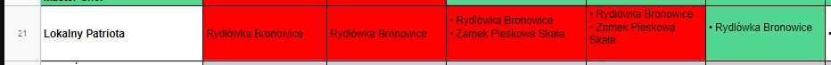

Podsumowanie Lipiec 2019, oj działo się. Działo się sporo w kwestiach prywatnych ale też sporo zadań zostało w taki lub inny sposób zrealizowanych. Poniżej lista 21 zadań na których się obecnie koncentruje. 

Widzę po tym już dość długim okresie podsumowań, że część założeń była błędna, część się zmienia jak również dochodzą nowe zadania. To jest normalne, warto zacząć realizować a życie zweryfikuje.

A tymczasem zapraszam Cię do podsumowania. 

\[divider\]

Lista zadań i aktualny status: [ZADANIA](https://blog.krzysztofbury.pl/zadania/).

\[space height="30"\]

#### **Zadanie 1: Dobry Mąż**

**Cel:**

 **** 1) Wakacje Węgry - Eger

 **** 2) 5 rocznica ślubu

Done.  Poniżej Eger w pigułce ;) wata cukrowa + dobre wino.

#### **Zadanie 2: Dobry Ojciec**

**Cel:** 

 **** 1) Wakacje - czas z rodziną

 **** 2) 4 urodziny 

Done.

#### **Zadanie 3: Budowniczy**

**Cel:** 

 **** 1) Trawnik

 **** 2) Hydroizolacja Piwnica

 **** 3) Renowacja Płot

2/3 jak na ilość pracy, do zrealizowania to naprawdę jestem bardzo zadowolony.

#### **Zadanie 4: Codzienne Treningi**

**Cel:** 

 **** 1) Suplementacja

 **** 2) 31 dni ćwiczeń 

Done. Pod ćwiczenia podciągnąłem prace fizyczne przy domu (uwierz, że się zmachałem mocno :))

#### **Zadanie 5: Korona Maratonów**

 **** **Cel:** Trzymanie się treningów z Endomondo

Nie trzymałem się treningów z Endomondo, sumarycznie przebiegłem **54 km**.

#### **Zadanie 6: Książka**

 **** Zawiesiłem to zadanie do końca września, skupiam się wyłącznie na przygotowaniu świetnego kursu online z SQL-a.

#### **Zadanie 7: Living Proof**

**Cel:**

 **** 1) Podsumowanie Czerwiec

 **** 2) Mailing Newsletter

 **** 3) 1x notatka z książki

Notatki z książki nie udało mi się zrobić, miałem inne priorytety.

Do zapisu na mailing zachęcam, po prawej stronie bloga - [Blog.KrzysztofBury.pl](https://blog.krzysztofbury.pl) znajdziesz formularz.

Dodatkowo, wyślę do Ciebie PDF-a z 5 notatkami z książek nt. przedsiębiorczości i rozwoju osobistego.

#### **Zadanie 8: Data Literacy**

 ** Cel:** Praca nad kursem.

Done. Przygotowałem darmowy dokument z 10 Trikami SQL do pobrania na [ZrozumSQL.pl](https://zrozumsql.pl).

Będę nieskromny jak napiszę, że jest to świetny dokument, no ale cóż tak uważam. Sporo pracy z mojej strony, ale wierzę (i słyszę) że innym też daje wartość.

#### **Zadanie 9: Prezentacje**

 **** W Lipcu nie miałem nic do zrealizowania.

#### **Zadanie 10: Finansowy Ninja**

 **** **Cel:** X oszczędzone

Nie oszczędziłem tyle ile zakładałem, pojawiły się “drobne” wydatki których nie uwzględniłem w budżecie.

#### **Zadanie 11: Religioznawca**

 **** W Lipcu i Sierpniu przerwa. Po Mitologii Nordyckiej i Słowiańskiej muszę na moment zresetować głowę. Wracam do Mitologii we Wrześniu.

#### **Zadanie 12: Biznesmen**

 ** Cel:** Praca nad kursem.

Done.

#### **Zadanie 13: Firma i Ludzie**

 **** W Lipcu nie zaplanowałem nic do zrealizowania.

#### **Zadanie 14: Lokalny Patriota**

 ** Cel:** Rydlówka Bronowice

**Yessss!** Wreszcie, praktycznie od początku roku się starałem to zrealizować - bez kitu.

Przebiegałem obok Rydlówki pewnie z 30 razy, ale “nigdy nie było czasu”. A tam gówno prawda, nie trzymałem się planów i tyle ale w końcu się udało.

Co do samego muzeum, taki **tip** **we wtorki jest za darmo**, nie widzę potrzeby przepłacać :) 

#### **Zadanie 15: Rentier**

 **** Po wynajęciu mieszkania, na razie nie mam nic do zrealizowania.

#### **Zadanie 16: Dobro Powraca**

 ** Cel:** Przelałem 1% wypłaty na cele dobroczynne

Done.

#### **Zadanie 17: Wdzięczność:**

 **** **Cel:** 31 dni notowałem za co jestem wdzięczny

17 z 31 dni. 

#### **Zadanie 18: Korona Ultramaratonów**

 **** **Cel:** 3 wybiegania dłuższe w terenie

2 z 3 biegów zrealizowany. 

#### **Zadanie 19: Rodzice**

 ** Cel:** X oszczędności

Oszczędzone.

#### **Zadanie 20: Rytuały**

 **** **Cel:** 20 dni wstawałem ~ 5:30

14 z 20 dni wstałem rano.

#### **Zadanie 21: Męskie Grono**

 **** **Cel:** Zaproponować dłuższy 3 / 4 dni w górach

To zadanie zostanie uogólnione, na Przyjaciele, myślę jak zmienić koncepcję i cele w zadaniu..

\[space height="30"\]

To tyle w tym podsumowaniu. Dziękuję, że jesteś tutaj ze mną.

Jeżeli jest coś co mogę dla Ciebie zrobić, daj znać na krzysiek <małpka> blog.krzysztofbury.pl. Odpowiadam na wszystkie maile.

 

Pozdrawiam,

Krzysiek
