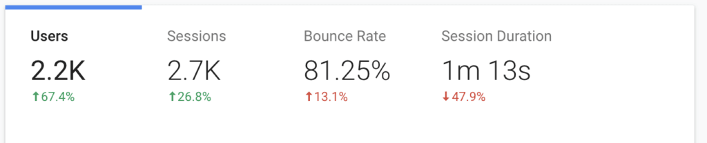

Cześć! Zapraszam Cię do wpisu Podsumowanie Roku 2019. Z końcem grudnia minie 2,5 roku od kiedy założyłem tego bloga. Znajdziesz na nim w sumie 68 wpisów - tyle niektórzy twórcy publikują w 3 miesiące. 

Jednak nie ilość miała być celem nadrzędnym, fakt chciałem zachować regularność, ale z drugiej strony … Pamiętaj że jesteś W Moim Świecie, pracuję równolegle nad innymi projektami i nie zawsze jestem w stanie poświęcić tyle czasu na każdą rzecz ile bym chciał.

W tym roku w statystykach skupię się wyłącznie na **stronie** [**https://blog.krzysztofbury.pl**](https://blog.krzysztofbury.pl)

Pozostałe projekty:

- [https://datacraze.pl](https://datacraze.pl)
- [https://datacraze.eu](https://datacraze.eu)
- [https://zrozumsql.pl](https://zrozumsql.pl)

traktuję już jako osobne byty, mam z nimi związane inne cele, dlatego nie widzę sensu w publikowaniu statystyk w tym miejscu. 

W tym wpisie znajdziesz:

- garść statystyk z bloga
- co się udało w 2019
- co się nie udało w 2019
- plany na 2020

 

## Statystyki [https://blog.krzysztofbury.pl](https://blog.krzysztofbury.pl)

- 2200 użytkowników
- 2700 sesji
- Współczynnik odrzuceń - 81,25%
- Długość sesji - 1 min 13 sek

 

Miałem w głowie pewne założenie względem tego bloga początkiem 2019. Obecne jednak to uległo zmianie. Ten blog traktuję jako swego rodzaju dziennik i miejsce w którym mogę zrzucić moje myśli i spostrzeżenia. Głównie dla mnie i moich bliskich, często łatwiej jest mi wyrazić coś pisząc o tym niż mówiąc. Jak pewnie wiesz znajdziesz tutaj przepisy na dania, które gotowałem, notatki z książek, które czytałem i garść przemyśleń. I tak zostanie też w przyszłości. Nie spodziewaj się proszę kilku wpisów w tygodniu. 

Spodziewaj się za to comiesięcznych podsumowań, 1 raz w miesiącu wiadomości email (jeżeli jesteś częścią mojego newslettera), z ciekawymi linkami, aktualnościami itd. No i przede wszystkim opiniotwórczych, obrazoburczych, emocjonalnych ale też tych z jajem wpisów, które będą wpadać na bloga niczym “Hiszpańska Inkwizycja”.

**Wracając do statystyk :)** 

 

## 3 najczęściej czytane wpisy

- - **Przepis:** [Amerykański Burger](https://blog.krzysztofbury.pl/2018/03/amerykanski-burger/) 
    - **Krzysiek “Coelho”:** [11 Myśli Na 3 Dekady Życia](https://blog.krzysztofbury.pl/2019/11/3-dekady-zycia/) 
    - **Przepis: [Frytki Z Sosem Poutine](https://blog.krzysztofbury.pl/2018/03/frytki-z-sosem-poutine/)**

Kucharz no ewidentnie jest nisza do zagospodarowania. Polska gotowaniem stoi i lubimy próbować swoich sił w różnych potrawach i stylach. Sam cieszę się kiedy mogę gotować dla moich bliskich, i myślę, że sporo osób ma podobnie.

 

## A ile zarobiłeś na blogowaniu?

Kolejny rok to samo pytanie, czy jest już 6 zer? No … nie, ale pracuję nad tym :) Ten blog nie ma być zarobkowy o tym pisałem już wyżej. Pracuje nad innymi produktami, które wierzę że dadzą sporo wartości, ale o tym więcej jak już będą dostępne. 

W planach m.in. napisanie książki i wydanie jej w formie elektronicznej a z branży technologicznej uruchomienie kursu online na początku nt. SQL-a. 

Jeżeli chcesz wiedzieć więcej, dołącz do **newslettera.** 

 

## Pozytywy 2019

- **Poziom 1 - Mąż:** 1 wieczór w tygodniu dla mnie i Moni
- **Poziom 1 - Ojciec:** Przynajmniej 1 aktywny dzień w tygodniu 
- **Poziom 1 - Budowniczy:** Oszczędzić 10% kwoty kredytu
- **Poziom 1 - Strengths Finder:** Osiągnąłem “sufit” w 1 z moich talentów - Learner
- **Poziom 1 - Lokalny Patriota** \- Odwiedziłem 20 wyjątkowych miejsc w Polsce
- **Poziom 1 - Rentier** - Dochód pasywny 1 500 zł miesięcznie
- **Poziom 3** - Zdobyłem Koronę Maratonów Polski
- **Religioznawca** - prawie skończyłem Poziom 2. W tym roku miałem w planach mitologie i dokończenie Nowego Testamentu. Została mi do przeczytania Mitologia Celtycka.
- **Dobroczynność** - pomagać innym można na różne sposoby. Ja wybrałem chyba tę najprostszą opcję, przekazywanie określonej kwoty miesięcznie i to udaje mi się bardzo sprawnie. 
- **Oszczędności dla rodziców** - powoli do przodu. Kluczem jest systematyczność, większe kwoty przyjdą w przyszłości.
- **Biegi Górskie / Przełajowe** - to właśnie w tym rodzaju biegania znalazłem największą frajdę i powolutku staram się to kultywować.

 

## Co mogłem zrobić lepiej w 2019

- **Nawyki: Codzienne ćwiczenia - koniec roku wygląda solidnie, jednak wcześniej w kratkę.**
- **Nawyki:** Prowadzenie dziennika - tak kwestia to naprawdę dobra cecha, pracuję nad nią każdego dnia i daje mi dużo satysfakcji. Chociaż zdarzały się dni przerwy.
- **Nawyki:** Poranny rytuał - jest kilka elementów - pobudka, medytacja, ćwiczenia, dziennik. Cześć z tych kwestii mi wychodzi sprawnie a nad częścią będę w dalszym ciągu pracował w kolejnym roku.
- **Projekt:** Książka - pisałem trochę, ale o wiele za mało. Dodatkowo postanowiłem w trakcie roku otworzyć mój kurs online, co pochłonęło większość mojego wolnego czasu.
- **Projekt:** Kurs Online ZrozumSQL - sporo pracy za mną, sporo przede mną. Planuję start w styczniu, czas pokaże czy się uda.
- **Cel:** prezentacje, publiczność 100 osób - miałem okazję wystąpić na paru konferencjach i poprowadzić garść warsztatów. Świetna sprawa, sprawia mi to mega radość. Cel względem publiczności miał być głównie motywatorem, ale jest jedynie zbędną przeszkodą. W dalszym ciągu, chcę brać udział w konferencjach w roli prelegenta, ale nie jest mi potrzebne przeliczanie ilości osób. Ten cel znika w 2020 roku.
- **Cel:** dochody z własnego biznesu - brak produktów, brak sprzedażym brak dochodów, co tu się rozpisywać.
- **Cel:** męski wypad - temat jest w trakcie realizacji :) 

 

## Plany Na 2020

- Większość planów wiąże się z realizacją zadań, dostępnych [TUTAJ](https://blog.krzysztofbury.pl/zadania) (nie będę powielał tej informacji).
- Doceniać to co osiągam i cieszyć się z sukcesów. 
- Udostępnić kurs online ZrozumSQL i poświęcić więcej czasu na moją działalność - Data Craze.
- Pracować nad nawykami, które udało mi się zbudować. 
- Pracować więcej z video - Instagram / Youtube. 

 

## Podsumowanie

Nie zawsze wszystko idzie zgodnie z naszym planem, a czasami my sami stoimy na drodzę do naszych celów

Mimo kilku niepowodzeń rok 2019 był jednym z lepszych lat w moim życiu. Bez kitu, chyba zaczynam wiedzieć “co chcę robić w życiu” a zaplanowane cele i praca nad nimi przynosi rezultaty. 

Życzę Ci wspaniałego roku 2020, realizacji wszystkich planów i żeby na koniec grudnia, po wigilijnym karpiu powiedzieć sobie, to był dobry rok. 

 

Dzięki,

Krzysiek
