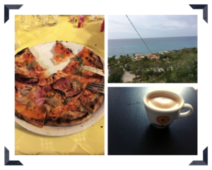
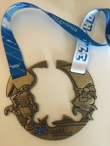

Wrzesień już prawie za nami, a skoro tak to … zapraszam na Podsumowanie Wrzesień 2019. Sporo podróży, kolejne “po co mi to było” na Maratonie, ciąg dalszy prac przy domu oraz przy kursie ZrozumSQL.

Chcesz wiedzieć więcej zapraszam Cię do szczegółowego podsumowania poniżej. 

\[divider\]

#### **Zadanie 1: Dobry Mąż**

 ** Cel:** Wakacje Włochy

Cel był prosty, na chwilę wyjechać, odpocząć psychicznie i złapać trochę słońca. Wszystko się udało.

#### **Zadanie 2: Dobry Ojciec**

**Cel:** 

 **** 1) Wakacje Włochy

 **** 2) Czytanie Wieczorem

Włochy podobnie jak wyżej, rodzinny wyjazd - fale i morze największą atrakcja :) Co do czytania to nad tym muszę więcej pracować, w tym momencie jesteśmy na etapie Mama, Mama, Tata już mnie chętnie. 

#### **Zadanie 3: Budowniczy**

**Cel:** 

 **** 1) Renowacja Płot

 **** 2) Prace wykończeniowe wewnątrz

Powolutku zbliżamy się do końca prac, zaplanowanych w ramach budowy domu. Przykład, świetnego planowania - ogarnę ten płot w 4 dni - skończyło się na miesiącu, ale daliśmy radę. Jeżeli, chodzi o prace wykończeniowe wewnątrz, nie wszystko udało się zrobić, no ale co by było wtedy do roboty w Październiku :) 

#### **Zadanie 4: Codzienne Treningi**

 ** Cel:** Trening Biegowy 

Taaa … 21 km + Maraton :) Także ten trening biegowy / codzienne treningi idą słabo. Widocznie nie jest to moim priorytetem / pasją, albo sam się ograniczam - co do pory treningów etc. ? Będę kontynuował temat przynajmniej do końca roku, zobaczymy jakie będą efekty i co dalej z tym zrobię.

#### **Zadanie 5: Korona Maratonów**

 ** Cel:** Wrocław Maraton

No sukces, cudownie ukończyłem Maraton Wrocławski! 

Ale czy na pewno sukces? Czas **5:05:32** \- cieszę się, że dobiegłem cały i zdrowy, ale doskonale wiem, że byłem kiepsko przygotowany. Czy lepiej mieć cel tylko do odhaczenia, czy lepiej zrobić coś na maksa nawet jak miałoby się nie udać? To temat na dłuższe pisanie, w Październiku czeka mnie jeszcze 1 bieg w Poznaniu i koniec przygody z Koroną Maratonów Polski.

#### **Zadanie 6: Książka**

 **** Zawiesiłem to zadanie, skupiam się wyłącznie na przygotowaniu świetnego kursu online z SQL-a.

#### **Zadanie 7: Living Proof**

**Cel:**

 **** 1) Podsumowanie Sierpień

 **** 2) Mailing

Podsumowanie sierpnia done. Co do mailingu na [https://blog.krzysztofbury.pl](https://blog.krzysztofbury.pl) przechodzę w tryb miesięcznego newslettera + ewentualne maile ad-hoc jak naprawdę mam coś ważnego / ciekawego do przekazania. Skąd taka decyzja? Mógłbym kontynuować cotygodniowy newsletter z ciekawymi linkami / artykułami, jednak momentami miałem wrażenie, że nie daje on takiej wartości jaką chciałbym żeby dawał. 

Może się w tej kwestii mylę, jeżeli uważasz, że tygodniowe maile dawały wartość to bardzo Cię proszę o informację zwrotną. Na ten moment jednak spróbuję przygotować solidniejszy materiały w formie miesięcznej.

#### **Zadanie 8: Data Literacy**

**Cel:** 

 **** 1) Praca nad kursem

 **** 2) Podcast Data Craze

Kurs nadchodzi - małymi krokami, ale nadchodzi. W międzyczasie rozdzieliłem strony Data Craze. 

Na [https://datacraze.pl](https://datacraze.pl) - zostanie strona całkowicie po polsku z polskim blogiem etc.

Na [https://datacraze.eu](https://datacraze.eu) - zostanie strona angielska z angielskim blogiem.

To jest narazie work in progress, ale mam nadzieję, że zamknę temat w październiku.

W przygotowaniu są również 3 pierwsze odcinki podcastu - Data Craze. Miałem plan opublikować odcinki we Wrześniu ale nie udało mi się w całości ich przygotować.

Podcast Data Craze: [https://anchor.fm/datacraze](https://anchor.fm/datacraze) 

#### **Zadanie 9: Prezentacje**

 **** We wrześniu nie miałem nic do zrealizowania.

#### **Zadanie 10: Finansowy Ninja**

 ** Cel:** X oszczędzone

Done.

#### **Zadanie 11: Religioznawca**

 ** Cel:** Mity Greckie i Rzymskie

Na wrzesień i październik zaplanowałem do (powtórnego) czytania i refleksji mity greckie i rzymskie. Klasycznie w tym przypadku autorstwa Jana Parandowskiego.

#### **Zadanie 12: Biznesmen**

**Cel:** 

 **** 1) Praca nad kursem

 **** 2) Założenie działalności gospodarczej

Tak jak pisałem parę punktów wyżej, prace nad kursem posuwają się do przodu, nie tak szybko jakbym chciał, ale lepiej tak niż wcale. 

Dodatkowo założyłem działalność gospodarczą potrzebną do kursu. Także ten dumnie mogę się nazwać CEO, COO, CFO, CTO i generalnie Pan od wszystkie w Data Craze Krzysztof Bury :D

#### **Zadanie 13: Firma i Ludzie**

 **** We wrześniu nie zaplanowałem nic do zrealizowania. Generalnie nie planuje zatrudniać nikogo w tym roku, zastanawiam się jedynie nad oddelegowaniem 1 kwestii jako formy umowy zlecenie z inną osobą, ale to narazie pozostaje w planach.

#### **Zadanie 14: Lokalny Patriota**

 ** Cel:** Zamek Pieskowa Skała

Szczerze to nie sądziłem, że damy radę podjechać i pozwiedzać Zamek Pieskowa Skała. We wrześniu mieliśmy całkiem sporo wyjazdów i zaplanowanych weekendów. Nie zrealizowałem tego zadania, przenoszę na Październik (też będzie ciężko ale spróbujemy :))

#### **Zadanie 15: Rentier**

 **** Po wynajęciu mieszkania, na razie nie mam nic do zrealizowania,

#### **Zadanie 16: Dobro Powraca**

 ** Cel:** Przelałem 1% wypłaty na cele dobroczynne

Done.

#### **Zadanie 17: Wdzięczność:**

**Cel:** 

 **** 1) Prowadzenie dziennika systematyczne. 

 **** 2) Medytacja

No pierwsze połowa miesiąca, bardzo solidnie, a o drugiej wypada zapomnieć. Tak to jest z nawykami, nie jest łatwo, ale i tak warto się starać i próbować.

#### **Zadanie 18: Korona Ultramaratonów**

 **** We wrześniu nie zaplanowałem nic do zrealizowania, z uwagi na **Maraton Wrocławski.**

#### **Zadanie 19: Rodzice**

 ** Cel:** X oszczędności

Oszczędzone.

#### **Zadanie 20: Rytuały**

 ** Cel:** Pobudka ~ 5:30

5 to więcej niż 0 ale mnie niż 30. No cóż czego się tutaj spodziewać, skoro nieregularnie kładę się spać to i nieregularnie wstaję. 

#### **Zadanie 21: Przyjaciele**

 ** Cel:** Przygotować plan imprezy urodzinowej

Mam w głowie co chciałbym zorganizować, potrzebuje jeszcze chwilę czasu, że to sfinalizować i ustrukturyzować. Nie zakończyłem tego zadania we Wrześniu, skończę w Październiku.

 

Dzięki,

Krzysiek
