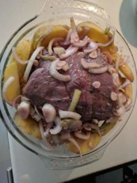

Roast Beef, Yorkshire Pudding, Onion Sauce, czyli pieczeń wołowa,  yorkshire pudding (epickie tłumaczenie) i sos cebulowy. Po fakcie porównałem z “oryginałem”, czyli zdjęciem tego dania z niedzielnego Angielskiego obiadu mojego kolegi - wyszło no prawie podobnie :) Do poprawy w przyszłości Yorkshire Pudding i sos pieczeniowy.

**Cel:** [Realizacja zadania 17 - Master Chef, poziom 1: potrafię ugotować po 1 daniu z każdej głównej kuchni świata](https://blog.krzysztofbury.pl/zadania/);

Na podstawie przepisów ze strony, [Notatnik Kuchenny](http://www.notatnikkuchenny.pl)

 

\[heading align="left"\] Składniki (na 4 osoby): \[/heading\]

**Pieczeń:**

- 1,5 kg wołowiny pieczeniowej (zrazowej)
- 1 cebula
- 4 marchewki
- 5 ziemniaków
- 1 por
- bulion wołowy (1 szklanka z kostki)
- 0.5l czerwonego wina (ja użyłem wytrawnego)
- 2 łyżki mąki
- 1 łyżka oleju

**Przyprawy**

- kilka ziaren pieprzu (nie liczyłem ~ 8)
- 4 łyżki musztardy (zwykła stołowa wystarczy)
- 2 liście laurowe
- 2 łyżeczki tymianku
- 4 ząbki czosnku (posiekane na plasterki)

 

**Pudding:**

- szklanka mąki
- 2 jajka
- szklanka mleka
- pół łyżki soli
- olej

 

**Sos Cebulowy:**

- 2 cebule
- 8 łyżek śmietany
- 10 dag masła

 

\[heading align="left"\] Przygotowanie \[/heading\]

**Sos Cebulowy:**

- Cebulę pokroić w okręgi (nie bardzo szerokie)
- Położyć na rozgrzanej patelni, żeby ją lekko przy grillować - będzie miała bardziej wyrazisty smak
- Dodać na patelnię masło
- Dusić długo na małym ogniu (do momentu aż cebula będzie miękka)
- Dodać śmietanę całość wymieszać i zmiksować 

 

**Yorkshire Pudding:**

- Do miski wsypać mąkę
- Dodać jajka, mleko oraz sól
- Całość energicznie mieszać, do powstania dość rzadkiego ciasta
- Ciasto odstawić na pół godziny
- Piekarnik rozgrzać do 180 st. C.
- Do pieczenia najlepsze będą foremki jak do babeczek / muffinów\*
- Do foremek wlej po 1 łyżeczce oleju i wstaw do rozgrzanego piekarnika na 15 min
- Po 15 min wyjmij z piekarnika blaszkę z foremkami i ostrożnie do każdego wgłębienia wlej tyle ciasta, aby wypełniło je w całości
- Wstaw z powrotem do piekarnika na około 20 - 25 min

 

**Pieczeń Wołowa:**

\[row\] \[two\_third\]

- Do miski / większego naczynia, dodajemy wino i przyprawy (sekcja przyprawy powyżej), całość mieszamy
- Do marynaty dodać wołowinę i całość odstawić na noc do lodówki
- Piekarnik rozgrzać do 200 st. C.
- Do większego naczynia żaroodpornego  / Brytwany dodać warzywa i odsączoną z marynaty wołowinę (nie wylewaj marynaty!)
- Podlać olejem i piec bez przykrycia około 35 / 40 min\*\*
- Wołowinę po upieczeniu wyjąć, zawinąć w folię i umieścić w ciepłym miejscu, żeby mogła dojść
- Z naczynia w którym pieczone było mięso, wyjąć warzywa, pozostały sos wymieszać ze szklanką bulionu i półtora szklanki winnej marynaty (w której marynowane było mięso)
- Sos zagotować, zredukować i zagęścić delikatnie mąką
- Wołowinę podawać podlaną sosem

\[/two\_third\] \[one\_third\]\[/one\_third\] \[/row\]

 

Smacznego!

 

\* najlepiej użyj jakiejś solidnej - sztywnej foremki

\*\* jeżeli dodałeś ziemniaki, po 35 / 40 min, pozostałe warzywa zostaw jeszcze na 20 / 25 min żeby ziemniaki mogły dojść
