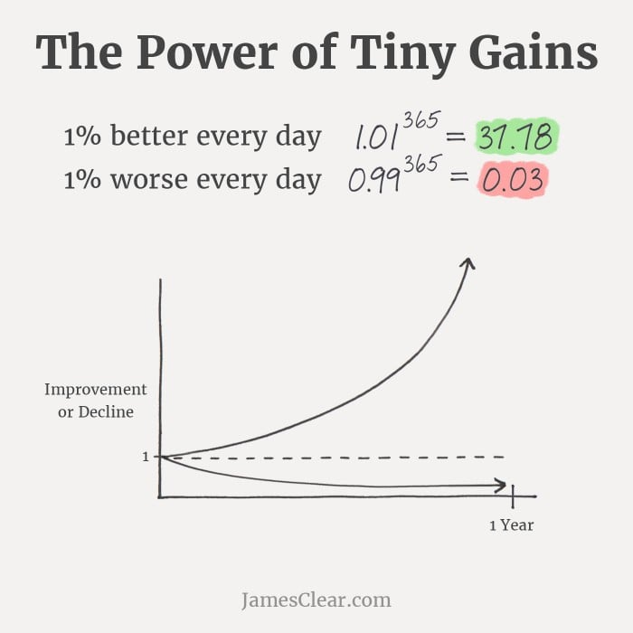

**3 dekady życia minęły - 26 Listopada 1989 Niedziela, chwilę po 7:00 rano przyszedłem na świat -** chciałem, żeby ten wpis był swego rodzaju podsumowaniem moich doświadczeń. Notatką dla mnie, z jasno sformułowanymi punktami, co jest ważne dla 30 letniego Krzyśka, czego nie wiedział wcześniej a chciałby.

Dziękuję Ci, że tu ze mną jesteś i czytasz ten wpis. Pamiętaj proszę, że nie ma on na celu motywowania, mówienia jak żyć, czy wskazywania drogi. Zebrałem tutaj **11 rzeczy**, które na ten moment są dla mnie ważne. Sposoby postrzegania świata i mojego podejścia do życia, rzeczy które znam i rozumiem, ale też takie których ciągle się uczę. 

Nie musisz, a może nawet nie chcę żeby się z nimi zgadzać, jak szumnie niesie podtytuł bloga, jesteś **“W Moim Świecie”,** jednak jeśli ciekawi Cię co tam się kryje w mojej głowie, zapraszam do wpisu poniżej.

 

## **Odpowiedz sobie na jedno zajebiście ważne pytanie …** 

 

Co chcę robić w życiu? No tak to jest zajebiście ważne pytanie, miałem różne pomysły na różnym etapie życia. Nikt tak jak ja w wieku 4 - 6 lat nie chciał zostać Paleontologiem, później Wojskowym, Architektem a dzisiaj, kim jest dzisiaj Krzysiek? 

Na dzień dzisiejszy wydaje mi się, że znalazłem swój cel i filozofię, którą chce podążać - “pomagam innym osiągać sukces, wyjaśniając dane”. Pytanie tylko na ile ta filozofia jest efektem tego jak kształtowało się moje życie a na ile faktyczną, pierwotną odpowiedzią na pytanie co chce robić w życiu.

Nie wiem, być może nigdy się tego nie dowiem. Co nie zmienia faktu, że nigdy wcześniej nie byłem tak pewien tego co chcę robić i dlaczego chcę to robić. Jak dla mnie jest to całkiem solidna podstawa, żeby dalej iść tą drogą. 

[https://www.youtube.com/watch?v=hQqBsvIB40E](https://www.youtube.com/watch?v=hQqBsvIB40E)

 

## **“Świat nie ma sensu. Trzeba mu go nadać samemu.”**

 

**M:** Żałujesz?

**D:** A ty żałujesz?

**M:** Ja nic nie zrobiłem.

**D:** No właśnie. Żałujesz, że nic nie zrobiłeś?

 

Powyższe to cytaty z filmu “Symetria”, pewnie się zastanawiasz co on tu robi - już tłumaczę. 

Nasze życie pod względem długości, w kontekście ogromu wszechświata jest jak pierdnięcie chomika. W sumie porównanie mało zasadne, nie doświadczyłem tej fizjologii u chomika (i proszę nie podsyłaj linków :)). Jednak w tym całym “poetyckim” porównaniu chodzi o to, że nasze życie jest krótkie, i w zasadzie bez większego znaczenia patrząc z szerszej perspektywy. 

Rodzimy się, dorastamy, chodzimy do szkoły, pracy, zakładamy rodziny, emeryturka i do piachu. Ot takie trywializowanie życia. Na pierwszych kilka etapów nie mamy większego wpływu, ale im dalej w las, tym bardziej znaczące są nasze decyzje. Możemy pozwolić, żeby to inni pokazywali nam w którą stronę mamy iść - wstawaj rano idź do pracy, pracuj 8 godzin wracaj do domu - a możemy sami spróbować, czy ta ścieżka jest faktycznie dla nas czy może za rogiem czai się inna? 

To którą wybierzesz zależy od Ciebie, pamiętaj, że masz wybór, to my jesteśmy twórcami naszego życia, to my nadajemy mu ton i sens. Celebruj tę “wolność”, inaczej wpadając w utarte schematy, zwykle gubimy to kim jesteśmy i to co moglibyśmy osiągnąć. Czy warto z tego rezygnować? 

Krzyśku z przyszłości, jeżeli to czytasz i nagle szukasz wszędzie sensu, boskich ingerencji, podpowiedzi z szumu drzew ... przestań. Zacznij działać, nie wyjdzie? Trudno, idź dalej i nigdy się nie poddawaj

 

## **Nie umartwiaj się, nie jesteś Chrystusem**

 

Nagłówek tego punktu jest dość niejednoznaczny, poruszę tutaj kwestię błędów i żalu. 

W życiu popełniłem wiele błędów, zraniłem kilka osób moją niedojrzałością czy słowami, które nie powinny paść. Błędy których zwykle można było uniknąć, ale “wtedy” po prostu byłem za głupi (chociaż uważałem, że zjadłem wszystkie rozumy), żeby znać rozwiązanie. Wszystkie osoby, które w jakikolwiek sposób poczuły się urażone, czy dotknięte moim zachowaniem, przepraszam … ale z drugiej strony nie żałuję.

“O Ty parszywcu, co to znaczy przepraszam a zaraz nie żałuję … chamie!” Ano, zdałem sobie sprawę, że przez wiele lat roztrząsałem pewne zdarzenia, mówiłem sobie jak to zajebiście ich żałuję i wypominałem sobie dlaczego ja się wtedy tak zachowałem. 

Jaki był tego efekt? Żaden, ani ja się nie czułem dobrze, ani nie poprawiało to sytuacji czy uczuć zranionej osoby. Ot taki impas wpadający w nutki dramatu, rozgrywającego się w mojej głowie. I po co mi to? 

Jak myślę o tych wszystkich rzeczach teraz? Gdy biorę na tapetą jakąś konkretną:

- Czy popełniłem błąd?
- Na czym polegał ten błąd?
- Jakie były skutki popełnienia tego błędu?
- Co mogłem zrobić, żeby go uniknąć?
- Czy teraz, zachowałbym się inaczej, jeżeli tak to jak?
- Czy naprawiać ten błąd (czy lepiej “nie wchodzić z butami w czyjeś życie”)? 

Jak potrzebuje zapisuje to w notesie i zamykam temat. Możesz powiedzieć “Prostak bez serca …”, no cóż, być może tak, ale taką drogę wybrałem. Żeby być najlepszą wersją siebie dla mnie i moich najbliższych nie mogę całe życie żyć przeszłością.

I nie zrozum mnie źle, nie chodzi tutaj o usprawiedliwianie siebie a później kolejny raz popełnianie tych samych głupot. Nie, chodzi tutaj o zrozumienie przyczyny i wyciągnięcie konkretnych wniosków, by w przyszłości nie robić tego po raz kolejny.

 

## **Przyjaźń**

 

> To zależy, czego od przyjaciół oczekujesz. Możesz nam zaufać, że cię nie opuścimy w dobrej czy złej doli, choćby do najgorszego końca. Możesz też nam ufać, że strzec będziemy twojej tajemnicy lepiej niż ty sam jej strzegłeś. Ale nie licz na nas, byśmy ci pozwolili samotnie stawić czoło niebezpieczeństwu i odejść od nas bez słowa. Jesteśmy twoimi przyjaciółmi. Boimy się okropnie, ale pójdziemy z tobą albo za tobą, jak psy za tropem. **J.R.R. Tolkien - Drużyna Pierścienia**

 

Mieć w swoim gronie przyjaciół to gigantyczny skarb i wielki dar. Jestem szczęśliwcem bo mam taką przyjemność, mieć kilka bardzo bliskich mi osób, których mogę nazwać przyjaciółmi.

Znają mnie doskonale, i nie przeszkadza im (aż tak bardzo :)) mój dziwny charakter. Szanują moje podejście do życia i podjęte decyzje. Potrafią szczerze powiedzieć, gdzie daję dupy i co oni zrobiliby inaczej. Nie głaszczą po głowie, nie miziają mojego ego, są sobą i bezinteresownie wiem że zawsze są gdy ich potrzebuję. 

Sprawdzeni w bojach jak 300-stu ze Sparty, trwają przy mnie mimo, że czasem wcale nie jest łatwo. Kocham ich wszystkich i każdą osobę z osobna, rzadko im o tym mówię, ale tak jest. 

Staram się być dla nich dokładnie tym kim oni są dla mnie, cytując klasyka “opoką”, “filarem”, i chciałbym żeby wiedzieli, że zawsze mogą na mnie liczyć. 

 

## **Codziennie, bądź lepszą wersją siebie**

 

Nie zawsze wszystko idzie po naszej myśli. Życie pisze różne scenariusze, ale czy to jest powód, żeby nie starać się być lepszym? 

Każdy z nas ma jakieś słabości, ja nie jestem inny w tym względzie, ale dla siebie i dla moich bliskich, chcę być codziennie lepszy.

Co to znaczy być lepszym? Nie wiem, każdy ma swoją definicję, czy muszę być lepszy, nie wiem, ja chcę być. 

James Clear, autor książki “Atomowe Nawyki”, pokazuje na wykresie, co się dzieje gdy przez rok jesteśmy tylko 1% lepsi lub 1% gorsi.

Parę lat temu uważałem, że jestem “Królem życia” - młody, zdolny, zdrowy - no Pan i Władca. Dzisiaj, już nie taki młody a już napewno nie taki piękny :) stawiam się gdzieś obok “Pazia” a życie jest moim królem. 

_**Brzmi patetycznie?**_ 

I dobrze, bo chodzi mi o to, że lepszym nie masz być z perspektywy innych, nie szukam splendoru, glorii i chwały. Lepszym mam być dla siebie, jak ja czuję się lepszym, to przekłada się to też na inne aspekty życia jak bliscy, rodzina czy praca.

Na tym blogu znajdziesz parę podsumowań miesięcy, robię to głównie po to, żeby uświadomić sobie, że: 

- po pierwsze nie jestem alfą i omegą, nie ze wszystkim sobie radzę najlepiej
- po drugie, że każdy miesiąc to postęp, względem tego gdzie byłem jeszcze miesiąc wcześniej (nie zawsze widoczny w kontekście cyferek i wyników).

 

## **Rodzina jest Królem Życia, tak jak Lew jest Król Dżungli**

 

Gdybym dzisiaj stracił wszystko co mam oprócz rodziny, to tak jakbym nic nie stracił.

Jestem wdzięczny, że mogę być mężem cudownej Moniki, i ojcem dwójki wspaniałych dzieci Alicji i Adama. I czasem nie jest łatwo, są rzeczy, które mnie wkurzają, których nie rozumiem. Momenty kiedy czuję się po prostu słaby i bezsilny, ale chyba na tym polega piękno i siła posiadania rodziny. Bez nich nie byłbym tu gdzie jestem teraz, nie byłbym tym kim jestem teraz. Dla nich chcę się jeszcze bardziej starać i nie wiem co bym zrobił gdybym ich stracił. 

Słabo mi idzie okazywanie uczuć (pracuję nad tym), łatwiej mi przychodzi pisanie o tym co czuję. A czuję sporo…

Parę dni temu bliska osoba zapytała mnie, co tak naprawdę jest w rodzinie (głównie w kontekście bycia rodzicem), przecież ja sam nierzadko byłem sceptyczny w tej kwestii. 

I tutaj nie mam cudownej odpowiedzi. 

Jak byłem sam było ok, miałem sporo czasu (który koncertowo marnowałem), mniej zmartwień, ogólnie plaża. Dzisiaj czasu nieco mniej to fakt, ale nauczyłem się jak lepiej go wykorzystywać. Zyskałem natomiast przyjaciółkę, która stoi koło mego boku, na dobre i na złe. Cytując Rycha Peje “zna mnie lepiej niż ja siebie, widziała mnie na glebie, zna upadek i cierpienie, zna każde wydarzenie”. Wierzy we mnie wtedy kiedy ja tracę wiarę. Za to i za miliony innych rzeczy jestem jej wdzięczny i kocham ją miłością prawdziwą.

I jak byliśmy sami było ok ;), mieliśmy sporo czasu (który zdarzało się, że marnowaliśmy), tylko trochę zmartwień, ogólnie plaża. Dzisiaj czasu nieco mniej to fakt, natomiast jest z nami dwójka cudownych dzieci. Dzieci, dla których chcę być przyjacielem, ojcem, kolegą, wujkiem dobra rada, a z drugiej strony, stanowczą i rozważną osobą. Tak wiele ról, tak niewiele czasu. Nie jest łatwo, są chwile gdy jesteś bezsilny, ale są też chwile w których słyszysz “kocham Cię” i cała reszta przestaje mieć znaczenie. 

Jeżeli chcesz wiedzieć czy warto zakładać rodzinę ja Ci nie odpowiem na to pytanie. Jedyne co mogę powiedzieć Tobie i sobie to to że są to najlepsze rzeczy jakie mnie mogły spotkać, cała reszta to przysłowiowa “wiśniówka na torcie” ;) 

Krzyśku z przyszłości, jeśli to czytasz, pamiętaj nie ma czegoś takiego jak za wiele przytuleń, za dużo całusów, czy szczerych słów kocham Cię. Włącz serce, wiem że trudno i empatia niska ale to te “niewielkie” gesty i słowa robią całą robotę.

 

## **Szukaj swojego spokoju**

 

Nie ważne czy jesteś chrześcijaninem, ateistą, buddystą, muzułmaninem czy wyznajesz bogów naszych przodków. Każdy w jakiś sposób dochodzi do momentów spokoju, czy to przez medytację, modlitwę czy w dowolny inny sposób.

Osoby, które mnie znają wiedzą, że szukam własnej drogi, staram się być chrześcijaninem, ale nie waham się zadawać trudnych pytań i szukać na nie odpowiedzi u źródła - w moim przypadku są to księgi różnych religii. 

Czasami modlę się do Boga, innym razem skupiam na medytacji. Czy to jest rozłączne, czy tożsame, nie wiem. Wiem jedno, że takie formy wyciszenia, pozwalają mi osiągnąć chwilę spokoju i jasności. 

Być może jak będę to czytał po latach, będę innego zdania, ale na dzień dzisiejszy, wiara choć krucha jest ze mną w takiej lub innej formie. Daje mi moment oddechu, pozwala się wyciszyć i z szerszej perspektywy spojrzeć na to co dzieje się dookoła.

W tym momencie jestem z Nią sam, nie szukam oparcia w instytucjach kościoła i obrzędach. Ktoś może powiedzieć, że to błąd i wiele tracę. Być może tak jest, ale w tym momencie chcę sam zrozumieć, czym dla mnie jest wiara, z czym ją utożsamiać z jakimi wartościami, co pomaga mi osiągnąć spokój i zrozumienie. Co przyniesie przyszłość … nie wiem.

 

## **Mów prawdę - a przynajmniej nie kłam**

 

_“Czasy podstawówki, zbite butelki ubite lufki …”_ no no no to akurat nie ja, ale spokojnie w czasach podstawówki możesz mnie nazywać Cesarzem Kłamstwa, Baronem Zmyślonych Rzeczy. Czego ja nie miałem i czego ja nie zrobiłem … cuda wianki na kiju.

Czy to było mądre? Przyniosło mi rzesze fanów? Popchnęło mnie do zajebistej kariery - może jakaś polityka albo coś :) ? 

**3 razy NIE, dziękujęmy.** 

Prawda, chociaż czas bywa bolesna, jest lepsza niż najpiękniejsze kłamstwo. I to akurat jest prawda. Staram się być szczery ze sobą i innymi osobami, mówić prawdę lub przynajmniej zamknąć gębę bo czasem i tak trzeba, ale na pewno nie mówić kłamstw. 

Zdarzało się, że na tym traciłem, zdarzało się, że ta prawda bolała, ale nigdy nie zdarzyło się żebym jej żałował. 

Pamiętam, jak w dzieciństwie łatwo mi przychodziło kłamstwo. Patrząc Tacie lub Mamie w twarz, bez mrugnięcia okiem, mówić nieprawdę. To był błąd, który zwykle szybko wychodził na jaw i często skutki były opłakane.

Nie chciałbym, dawać takich wzorców moim dzieciom czy najbliższym. 

“Wiesz  kochanie Tata tutaj delikatnie miną się z prawdą.” No nie, nie tędy droga, na kłamstwie nie zbudujesz szczerych i prawdziwych relacji. 

“Także Krzyśku z przyszłości (i Sabo :)), nie idźcie tą drogą” 

 

## **Nie czekaj na ostatnią chwilę**

 

Większość z nas nie wie, ile nam zostało czasu. Chcemy zrobić tyle rzeczy, tyle zobaczyć, tyle powiedzieć, a być może zaraz jebnie nas tramwaj i dziękuję dobranoc. 

Oczywiście, ani sobie ani Tobie tego nie życzę, wprost przeciwnie, wierzę, że dożyjemy sędziwej starości, w gronie naszych bliskich. 

Co nie znaczy, że wszystkie rzeczy i tematy powinniśmy odłożyć na ostatnią chwilę. 

Przykład, mam to szczęście, że mam Mamę i Tatę, ale tak naprawdę, nigdy im tego nie powiedziałem. 

Nie powiedziałem im, że cieszę się że ich mam, że mogę być ich synem. Że wychowali mnie na dobrego człowieka, że zawsze mogę na nich liczyć i że oni mogą liczyć na mnie. Że są dla mnie wzorem rodziców, ale też motywacją do tego bym ja był jeszcze lepszy. Że pomimo tego, że życie ich nie oszczędzało zawsze dawali radę. Że chociaż czasem było mniej ciekawie to są dalej razem i potrafią cieszyć się sobą. I że ich kocham, chociaż o tym nie mówię… 

Tak drogi Krzyśku z przyszłości, a Ty dalej czekasz?  

 

## **Nie pij wódy!**

 

Złe nawyki, nałogi i konsekwencje które ze sobą niosą. “I ja tam byłem z nałogami walczę i walczyłem”, więc spokojnie, niestety te rzeczy nie znikają od tak.

A mówiąc jeszcze dosadniej, zostaną z Tobą i ze mną do końca życia. Na to na co mamy wpływ, to czy chcemy je kultywować czy zabić je w naszej głowie. 

Istnieje szansa, że poradzisz sobie z tym samem - ale mała - często potrzeba kogoś bliskiego, komu zaufasz i kto Ci pomoże. Ale ale, bo tak naprawdę chciałem tu napisać coś innego.

W tym akapicie nie chodzi mi o to, żeby piętnować wszystkie używki i w ogóle mówić, że to wszystko zło jest. No nie do końca, chodzi mi tu o to żeby być świadomym tego co się robi i jakie decyzje się podejmuje. 

Kiedyś były momenty, że wódkę piliśmy na butelki, dzisiaj staram się tego unikać, a przynajmniej panować nad ilością. I oczywiście nie jestem święty nie zawsze się udaje, ale to nie jest powód, żeby przestać próbować. 

Powyższy to tylko jeden z przykładów, każdy zły nawyk czy nałóg mają swoje konsekwencje, być może na krótką metę nie dostrzegalne, ale w dłuższej perspektywie dadzą o sobie znać. Kluczem jest świadomość decyzji, które podejmujemy i świadomość tego co stoi za tymi decyzjami - jakie uczucia, emocje, żądze, pragnienia chcemy zaspokoić. 

Dlatego Krzyśku z przyszłości, nie pij wódy, świadomie podejmuj decyzje nie zostawiaj ich dla Twojej nieświadomej odurzonej głowy. 

Tutaj posłuchaj więcej, o. Adam dobrze mówi: [https://www.youtube.com/watch?v=4IagWCDAyAM](https://www.youtube.com/watch?v=4IagWCDAyAM)

 

## **Nie zakładaj niczego, komunikacja to podstawa**

 

Zdarza mi się, że jeszcze przed rozpoczęciem rozmowy zakładam jakieś rzeczy o drugiej osobie. Na podstawie wyglądu, tonu głosu, emocji etc. - błąd!

Nie siedzę drugiej osobie w głowie, nie wiem tak naprawdę co czuję, co przeżywa, z jakimi emocjami się zmaga. Wnioskowanie tego wszystkiego jest nic nie warte, i niejednokrotnie szkodziło całej dyskusji. 

Dzisiaj staram się niczego nie zakładać, na tyle na ile umiem, słucham i próbuję zrozumieć, jak ja mogę pomóc w danej sytuacji. Czy moje doświadczenia okażą się pomocne czy może wprost przeciwnie, będą bezwartościowym szumem. Jeżeli czegoś nie wiem, lub nie rozumiem, pytam, co dana osoba miałą przez to na myśli. 

To nie jest łatwe, szczególnie w chwilach większych emocji czy wzburzenia. Zakładanie jest proste, Ty myślisz tak, ok to ja Ci tu zaraz do pieprzę “bo w dupieś był i gówno widział”. Często rodzi problemy, które zdarza się, że są duszone gdzieś tam wewnątrz i wychodzą przy okazji jakiejś kłótni czy sprzeczki. 

Czy naprawdę, tak chcemy ze sobą rozmawiać, domyślając się co to drugie ma na myśli? 

 

## **Podsumowanie**

Trzy dekady, 30 spełnionych lat, jestem dumny z miejsca w którym jestem teraz, i wdzięczny za każdy dzień. Dlatego a może dzięki temu, z okazji moich 30-stych urodzin, to ja chciałbym złożyć Tobie garść życzeń. 

 

Życzę Ci znalezienia własnej drogi, i nie zbaczania z niej w chwilach lęku i zwątpienia. Wiary, że ewentualny upadek jest “sukcesu nawozem”. Wiele energii, wyrozumiałości i sporo miłości potrzebnych do dbania o relacje z rodziną i bliskimi. Masę odwagi w walce z sobą samym i swoimi słabościami. Dla siebie i dla Twoich bliskich zasługujesz by być najlepszą wersją siebie. 

> Nikt prawie nie wie, dokąd go zaprowadzi droga, póki nie stanie u celu.
